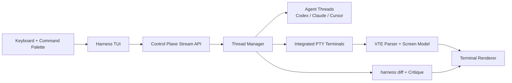

# Harness

Harness is minimal agent orchestration in the terminal.

Programmable, agent-agnostic, threaded, ergonomic, and fast.

## What matters most

- Parallel threads across `codex`, `claude`, `cursor`, `terminal`, and `critique`.
- One command palette (`ctrl+p`) to jump threads, run actions, and control workflow quickly.
- Toggle the bottom debug bar with `cmd+p` when you need runtime launch/auth context.
- Codex, Claude Code, and Cursor together in one workspace.
- Diff with Critique, with integrated terminals (`harness diff` + critique actions).
- Detached gateway sessions keep long-running work alive through reconnects.
- Open the active project directly in local tools (`iTerm2`, `Ghostty`, `Zed`, `Cursor`, `VSCode`, `Warp`, `Finder`) or copy its path from the palette.

## Demo


## Quick start

Prerequisites:

- Bun `1.3.9+`
- At least one agent CLI (`codex`, `claude`, `cursor`, or `critique`)

Install and run:

```bash
# Bootstrap install
curl -fsSL https://raw.githubusercontent.com/jmoyers/harness/main/install.sh | bash

# Or run directly (no global install)
bunx @jmoyers/harness@latest

# Or install globally
bun add -g --trust @jmoyers/harness
harness
```

Use a named session when you want isolated state:

```bash
harness --session my-session
```

Named sessions automatically fall back to an available gateway port when the preferred port is already occupied. For deterministic restart/load diagnostics, you can still set an explicit non-default gateway port.

Standalone diff viewer (phase 1):

```bash
harness diff --help
```

## Architecture (VTE path)


