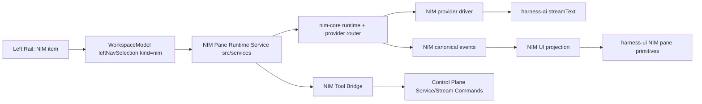

# NIM Experiential Parity Design + Roadmap (Temporary)

Date: 2026-02-21  
Branch: `jm/nim-next`  
Status: planning document for execution; does not override `design.md`, `behavior.md`, or `agents.md`.

## 1. Intent

Ship a pinned NIM experience inside the main Harness mux UI that feels like Codex in use, while remaining first-party and architecture-compliant:

- use Codex behavior and structure as reference only,
- do not import or reuse Codex libraries,
- build and extend our own `packages/harness-ui` primitives,
- route NIM actions through Control Plane APIs/tools (no privileged side channel).

## 2. Experiential Target (v1)

The v1 experience is done when all are true:

- Left rail has a persistent `NIM` sibling entry next to the existing top-level entries (`home`, `tasks`, etc).
- Selecting `NIM` opens a dedicated right-pane NIM session view instead of the standard conversation pane.
- NIM view has a pinned bottom composer and streaming transcript above it.
- NIM session continues running when the user leaves and re-enters the pane.
- NIM exposes gateway/control-plane capabilities as tools so it can inspect and operate within Harness.
- NIM supports two output modes:
- `user`: minimal, user-facing.
- `debug`: explicit lifecycle timeline (thinking/tool calls/state changes).
- Keyboard semantics are consistent:
- `Enter`: submit when idle, steer when active.
- `Tab`: queue follow-up.
- `Esc`: abort active run.

## 3. Constraints and Non-Goals

- All mutating operations remain behind Control Plane Stream command contracts.
- `packages/harness-ui` must not import `src/*` runtime internals.
- No callback mega-bags or forwarding wrapper classes.
- No NIM-specific fork of the core mux runtime architecture.
- Non-goal for v1: full replacement of existing conversation rail/session model.
- Non-goal for v1: introducing external UI/rendering dependencies for the hot path.

## 4. Architecture Shape

### 4.1 Ownership Boundaries

- `packages/nim-core`: session/run orchestration, provider routing, canonical NIM event stream.
- `src/services/runtime-nim-*`: mux app-layer lifecycle, subscriptions, action dispatch, tool bridge wiring.
- `src/mux/live-mux/*`: selection, navigation, and pane composition.
- `packages/harness-ui/src/*`: reusable rendering/input primitives used by mux and NIM view.

### 4.2 Persistence Model

- Continue sqlite-backed NIM stores (`events.sqlite`, `sessions.sqlite`) under harness runtime paths.
- Persist selected NIM session ID in mux UI/app state so NIM resumes after restart.
- Maintain tenant/user boundaries for every NIM stream/read/write.

## 5. Module Plan

### 5.1 Navigation + Pane Routing

- Extend `LeftNavSelection` with `kind: 'nim'` in `src/mux/live-mux/left-nav.ts`.
- Add NIM rail action/row projection in `src/mux/workspace-rail-model.ts`.
- Add NIM entry dispatch in `src/services/left-rail-pointer-handler.ts`.
- Add `WorkspaceModel.enterNimPane()` and state fields in `src/domain/workspace.ts`.
- Extend right-pane branching in `src/services/runtime-right-pane-render.ts` to render NIM pane when selected.

### 5.2 NIM Pane UI Composition

- Add a dedicated NIM pane composer/state reducer in `src/mux/live-mux/nim-pane.ts`.
- Add reusable primitives in `packages/harness-ui/src` for:
- transcript viewport with incremental append/scroll behavior,
- pinned multi-line composer,
- compact status/tool timeline rows.
- Reuse existing theme pipeline and add NIM token surfaces in `src/ui/mux-theme*.ts` where needed.

### 5.3 Runtime Services for NIM in Mux

- Add `src/services/runtime-nim-session.ts` for start/resume/switch-model lifecycle.
- Add `src/services/runtime-nim-stream-subscriptions.ts` for event/UI stream attachment and teardown.
- Add `src/services/runtime-nim-actions.ts` for send/steer/queue/abort.
- Add `src/services/runtime-nim-state.ts` for in-memory projection consumed by the NIM pane.

### 5.4 Control Plane Tool Bridge

- Add `src/services/runtime-nim-tool-bridge.ts` mapping NIM tool calls to typed Control Plane operations.
- v1 tool categories:
- workspace introspection (`directory.list`, `repository.list`, `task.list`, `session.list`),
- conversation/session control (`session.status`, `session.respond`, `session.interrupt`),
- project/review visibility (`github.project-review`, `project.status`).
- Mutating tools ship in guarded steps with explicit allowlist and evented audit in NIM timeline.

### 5.5 CLI and Entry Points

- Keep `scripts/nim-tui-smoke.ts` as a smoke harness.
- Route production UX through `harness` mux runtime, not a parallel standalone NIM app.

## 6. Roadmap

### Phase 0: Baseline and Contracts

- [ ] Define `nim` left-nav selection and pane-mode contract.
- [ ] Define NIM pane state model and reducer inputs.
- [ ] Define NIM tool bridge interface with typed command/result envelopes.
- Exit criteria:
- compile-time contracts in place with unit tests for parser/reducer behavior.

### Phase 1: Pinned NIM Shell in Mux

- [x] Add NIM left-rail item and selection behavior.
- [x] Add empty/skeleton NIM right pane with pinned composer/footer.
- [x] Persist/restore NIM pane selection state.
- Exit criteria:
- NIM is reachable via pointer + keyboard cycle and survives app restart.

### Phase 2: Runtime Wiring (Mock and Deterministic)

- [x] Instantiate/reuse NIM runtime handle from mux services.
- [x] Wire send/steer/queue/abort to NIM actions.
- [x] Render streamed deltas + state transitions in the NIM pane.
- Exit criteria:
- deterministic mock mode fully functional in mux with replayable event trace.

### Phase 3: Control Plane Tool Surface

- [x] Implement read-first tool bridge to control-plane commands.
- [x] Surface tool lifecycle (start/args/result/error) in debug mode.
- [x] Add policy allow/deny control for NIM tool exposure.
- Exit criteria:
- NIM can inspect Harness state via tools and show observable lifecycle.

### Phase 4: Live Provider and Parity Polish

- [x] Enable Anthropic driver path via existing `nim-core` driver registration.
- [x] Improve composer ergonomics, timeline compaction, and status/footer clarity.
- [x] Add keybinding parity (`Enter`/`Tab`/`Esc`) in mux runtime.
- Exit criteria:
- live run in mux replicates expected Codex-like flow with our UI stack.

### Phase 5: Hardening and Readiness

- [ ] Unit/integration/e2e coverage at project standards.
- [ ] Performance pass on render path and event fanout.
- [ ] Update `behavior.md` for new surfaces once behavior is implemented.
- Exit criteria:
- feature is reliable under restart, queue, abort, and tool-heavy runs.

## 7. Test Plan (By Surface)

- Left rail selection and routing:
- `test/mux-workspace-rail-model.test.ts`
- `test/services-left-rail-pointer-handler.test.ts` (new)
- `test/mux-live-mux-global-shortcut-handlers.test.ts`

- Workspace/pane state:
- `test/domain-workspace.test.ts`
- `test/services-runtime-right-pane-render.test.ts`
- `test/services-mux-ui-state-persistence.test.ts`

- NIM runtime wiring:
- `test/nim-core-runtime.test.ts`
- `test/nim-runtime-provider-driver.test.ts`
- `test/nim-functional-use-cases.test.ts`
- `test/services-runtime-nim-*.test.ts` (new)

- Tool bridge and control-plane parity:
- `test/control-plane-api-parity.test.ts`
- `test/services-runtime-control-plane-ops.test.ts`
- `test/services-runtime-nim-tool-bridge.test.ts` (new)

- End-to-end behavior:
- `test/codex-live-mux-startup.integration.test.ts` (extend with NIM pane path)
- `test/nim-tui-smoke.test.ts`
- `scripts/integration-nim-haiku.ts` in CI gate for live validation.

## 8. Delivery Slices (Proposed PR Order)

1. PR-1: left rail `nim` entry + pane shell + persisted selection.
2. PR-2: NIM runtime service wiring with mock mode and event rendering.
3. PR-3: control-plane read tools and debug lifecycle projection.
4. PR-4: live provider path + keybinding and UX parity polish.
5. PR-5: coverage closure, perf validation, and docs alignment updates.

## 9. Open Decisions

Resolved:
- Single NIM session is workspace-scoped for v1.
- Mutating control-plane tools are deferred to v1.1.
- Debug timeline remains visible in `debug` mode; user-facing mode is named `user`.

## 10. Immediate Next Step

- Execute Phase 5 hardening: broaden test closure, run perf pass, and update `behavior.md`.
