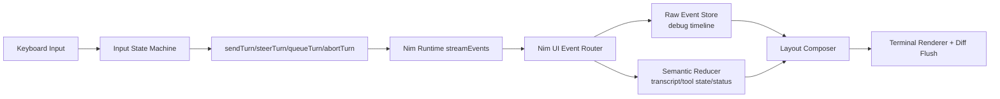

# Nim TUI Upgrade Plan

Date: 2026-02-20  
Branch: `jm/nim`  
Context: capture current plan before merge; perform UI library extraction in a follow-up branch.

## Goal

Upgrade Nim TUI to a long-term, full-screen, debug-capable interface with transparent streaming and tool lifecycle visibility, while aligning interaction semantics with Codex-style steer/queue behavior.

## Product Requirements

- Codex-like look and feel (terminal-native, theme-adaptive styling).
- Themed approach consistent with Harness.
- Real-time streaming output as deltas arrive.
- Tool-call visibility similar to Codex/Claude Code.
- Full-screen layout with pinned chat input.
- Debug mode embedding detailed event flow with visual structure.
- Keybindings:
  - `Enter`: submit / steer
  - `Tab`: queue
  - `Esc`: abort

## UI Library Work Needed

- [ ] Extract shared terminal UI primitives into a reusable library package:
  - rendering surface/diff flush
  - layout blocks
  - key decoding + input routing
- [ ] Define a Nim theme token contract on top of existing Harness theme resolution:
  - transcript, composer, status line, tool rows, debug timeline, accents
- [ ] Add terminal-adaptive styling policy:
  - default fg/bg first
  - dim/bold for hierarchy
  - restrained accent palette (`cyan`, `green`, `red`, `magenta`)
  - avoid brittle hardcoded full-palette assumptions
- [ ] Build a Nim UI reducer/projection layer with dual modes:
  - `seamless`
  - `debug`
- [ ] Preserve 1:1 transparency:
  - raw ordered event stream
  - semantic UI stream
  - rendered frame stream
- [ ] Build full-screen layout:
  - scrollable transcript region
  - pinned bottom composer
  - status/footer row
- [ ] Implement tool lifecycle UI:
  - start/args-delta/end/error
  - grouped by `tool_call_id`
- [ ] Implement streaming render + message commit:
  - delta rendering
  - first-class final message commit event handling
- [ ] Implement input state machine:
  - `Enter` => submit if idle, steer if active
  - `Tab` => queue
  - `Esc` => abort active run
- [ ] Build independent test TUI on same libraries (separate from harness runtime app/harness shell wiring).

## Proposed Architecture

## Public API Targets

- [ ] `createNimTuiApp(...)`
- [ ] `start()`
- [ ] `dispose()`
- [ ] `setMode('debug' | 'seamless')`
- [ ] `setTheme(themeId | themeObject)`
- [ ] `submit(text)`
- [ ] `steer(text)`
- [ ] `queue(text)`
- [ ] `abort()`
- [ ] `subscribeRawEvents(cb)`
- [ ] `subscribeUiEvents(cb)`
- [ ] `subscribeFrames(cb)`

## Execution Phases

### Phase 1 (current branch: `jm/nim`)

- [ ] Record this plan (`nim.md`).
- [ ] Merge/rebase from `main`.
- [ ] Verify baseline behavior and performance wall-clock before extraction.

### Phase 2 (follow-up branch)

- [ ] Extract shared UI library package.
- [ ] Migrate `harness nim` to the new full-screen TUI app.
- [ ] Land debug/seamless mode parity in one stack (no parallel implementation paths).

### Phase 3 (verification)

- [ ] Unit coverage at 100% for new UI library + Nim TUI state machines.
- [ ] Integration/functional coverage at 100% for end-to-end streaming/tool/debug/keybinding behavior.
- [ ] Haiku integration exercised continuously in verification workflow.
