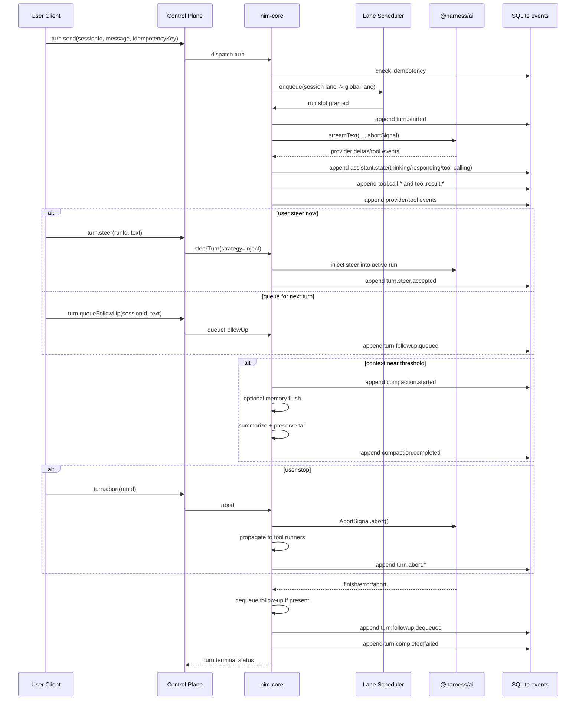
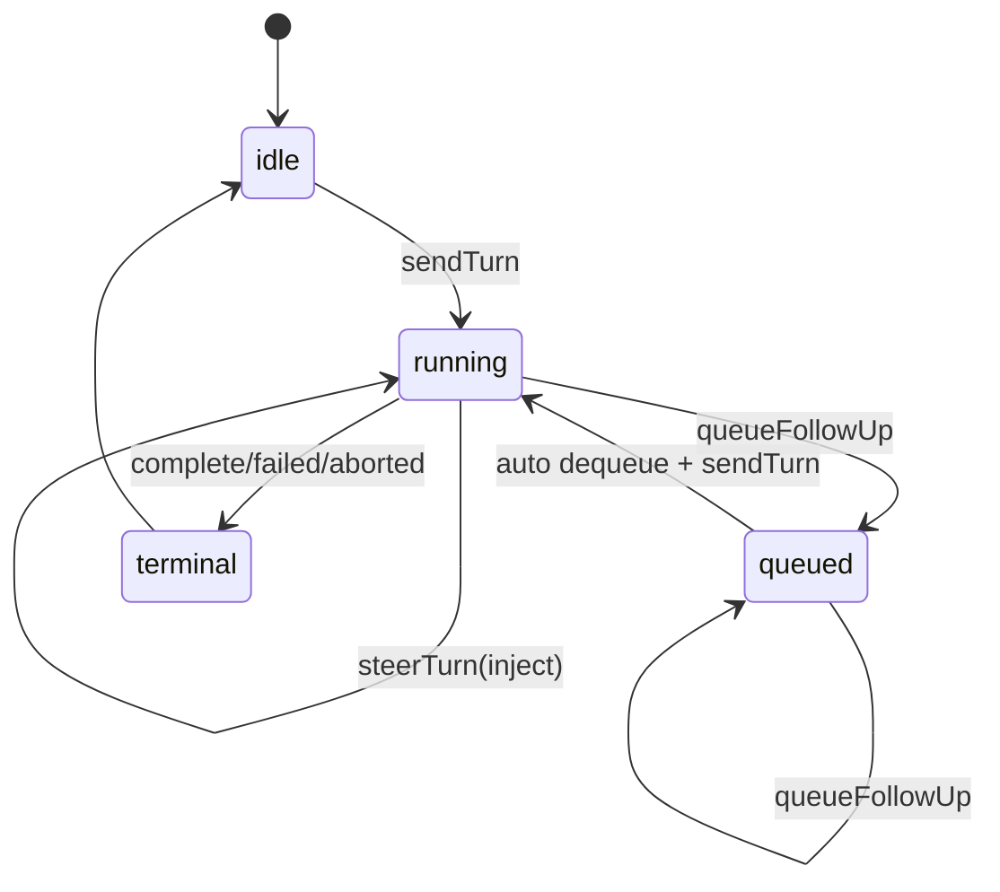

# Nim Agent Library Research Proposal and Functional Spec

Date: 2026-02-20
Branch: `jm/nim`
Agent name: `nim`

## 1. Objective
Build a first-party, platform-agnostic agent runtime on top of `@harness/ai` that powers Harness TUI/framework clients with:

- model-provider switching
- tool exposure and policying
- conversation continuation
- compaction
- replay-grade telemetry/logging
- full-stack abort
- steering + queued follow-ups
- memory
- soul
- skills

This document is systems-first and maps public APIs to functional requirements with verifiable acceptance criteria.

## 1.1 Current Branch Status (`jm/nim`)

- `nim-core` now includes a provider router and driver contract (`NimProviderRouter`, `NimProviderDriver`) and runtime integration path.
- `InMemoryNimRuntime` routes provider-backed turns through registered provider drivers, with fallback mock execution when no driver is registered.
- First provider-driver scaffold exists for Anthropic on top of `packages/harness-ai` (`createAnthropicNimProviderDriver`).
- Live Haiku smoke now includes fallback model `claude-3-haiku-20240307` for environments where `claude-3-5-haiku-*` IDs are unavailable.
- Live Haiku smoke now asserts runtime observability state transitions through `nim-core` stream APIs (`thinking -> tool-calling -> responding -> idle`) plus raw tool/thinking lifecycle visibility.
- Functional UC execution now has explicit coverage for UC-01 through UC-12 in `test/nim-functional-use-cases.test.ts`.
- Runtime now records explicit soul/skills/memory snapshot lifecycle events per turn and includes per-turn `soul_hash` / `skills_snapshot_version` envelope metadata for replayability.
- Runtime now includes deterministic overflow compaction simulation paths with bounded retry/failure events for verifiable UC-06 behavior.
- Runtime now exposes first-class `replayEvents` snapshots with deterministic event-id windowing (`fromEventIdExclusive`, `toEventIdInclusive`) for UC-09 replay APIs.
- Runtime now supports first-class telemetry sink registration (`registerTelemetrySink`) and first-party JSONL telemetry I/O (`NimJsonlTelemetrySink`, `readNimJsonlTelemetry`) for replay-grade event logging and deterministic reload.
- Runtime now persists canonical envelopes through a pluggable event store abstraction (`NimEventStore`) with first-party `InMemoryNimEventStore` and `NimSqliteEventStore` adapters.
- Runtime now persists session metadata and idempotency mappings through a pluggable session store abstraction (`NimSessionStore`) with first-party `InMemoryNimSessionStore` and `NimSqliteSessionStore` adapters.
- Session store now persists queued follow-ups so queue ordering and dequeue semantics survive runtime restart boundaries.
- Runtime now includes first-party factory wiring (`createSqliteBackedNimRuntime`) for SQLite event/session stores plus optional JSONL telemetry sink composition.
- Runtime now fails closed for restart idempotency ambiguity by emitting `turn.idempotency.unresolved` and rejecting reuse when stored run IDs have no terminal event.
- `nim-test-tui` now includes canonical stream collector utilities (`collectNimTestTuiFrame`) for deterministic, independent test UI snapshots without mux-runtime coupling.
- A first interactive CLI/TUI smoke entrypoint now exists as `harness nim` (with direct script alias `bun run nim:tui`) via `scripts/nim-tui-smoke.ts` for manual end-to-end validation of run/replay/queue/abort flows.

## 1.2 Execution Evidence (2026-02-20)

- Functional UC coverage (`test/nim-functional-use-cases.test.ts`) now spans UC-01 through UC-12 and is passing.
- Runtime/provider/snapshot regression suite is passing:
  - `test/nim-core-runtime.test.ts`
  - `test/nim-runtime-factory.test.ts`
  - `test/nim-session-store.test.ts`
  - `test/nim-replay-parity.test.ts`
  - `test/nim-tui-smoke.test.ts`
  - `test/nim-runtime-provider-driver.test.ts`
  - `test/nim-test-tui-boundary.test.ts`
  - `test/nim-functional-use-cases.test.ts`
- Branch quality gates are passing at 100%:
  - `bun run verify`
  - `bun run test:integration:nim:haiku`
- Live Haiku integration continues to verify runtime transparency signals (state transitions + tool lifecycle visibility).

## 2. Sources Reviewed

### Harness baseline
- `design.md`
- `agents.md`
- `packages/harness-ai/src/index.ts`
- `packages/harness-ai/src/types.ts`
- `packages/harness-ai/src/stream-text.ts`

### encamp-scout reference (`~/dev/ash-1`)
- `packages/encamp-scout/core/src/agent/scout-agent.ts`
- `packages/encamp-scout/core/src/providers/registry.ts`
- `packages/encamp-scout/core/src/streaming/stream-orchestrator.ts`
- `packages/encamp-scout/core/src/context/compactor.ts`
- `packages/encamp-scout/core/src/context/result-store.ts`
- `packages/encamp-scout/core/src/memory/scratchpad.ts`
- `packages/encamp-scout/core/src/skills/*.ts`
- `packages/encamp-scout/core/src/session/*.ts`
- `packages/encamp-scout/core/src/logging/*.ts`
- `packages/encamp-scout/core/src/telemetry/*.ts`

### OpenClaw reference
- https://docs.openclaw.ai/concepts/agent
- https://docs.openclaw.ai/concepts/agent-loop
- https://docs.openclaw.ai/concepts/compaction
- https://docs.openclaw.ai/concepts/memory
- https://docs.openclaw.ai/concepts/model-providers
- https://docs.openclaw.ai/tools/index
- https://docs.openclaw.ai/tools/skills
- https://docs.openclaw.ai/concepts/session
- https://docs.openclaw.ai/gateway/logging
- https://docs.openclaw.ai/start/bootstrapping
- https://docs.openclaw.ai/llms-full.txt

### OpenClaw source reference (cloned)
- repo: `/tmp/openclaw-src-nim`
- commit: `6bc9824` (2026-02-19)
- `src/agents/pi-embedded-runner/run.ts`
- `src/agents/pi-embedded-runner/run/attempt.ts`
- `src/agents/pi-embedded-runner/runs.ts`
- `src/commands/agent.ts`
- `src/agents/pi-tools.ts`
- `src/agents/skills/workspace.ts`
- `src/agents/skills/refresh.ts`
- `src/agents/workspace.ts`
- `src/config/zod-schema.agent-defaults.ts`
- `src/config/sessions/store.ts`
- `src/logging/logger.ts`

### Codex behavior reference
- https://developers.openai.com/codex/cli#features
- https://openai.com/index/introducing-upgrades-to-codex/

## 3. Key Research Findings

### 3.1 From encamp-scout (adoptable patterns)
- Headless core + multiple client surfaces is workable.
- Provider registry + runtime model swap can be simple and explicit.
- Stream orchestrator should pass through provider event semantics, not flatten everything.
- Compaction and memory need explicit modules, not hidden side effects.
- Skill loading/discovery with deterministic precedence is practical.
- Session manager + orchestrator split helps with multi-surface continuation.

### 3.2 From OpenClaw (adoptable patterns)
- `provider/model` is the right model identity shape.
- Tool profile layering (base profile + provider-specific narrowing + allow/deny) is highly practical.
- Compaction should persist to transcript/session history and emit explicit lifecycle events.
- Silent pre-compaction memory flush is useful when context pressure is high.
- Workspace identity files (`SOUL.md`, etc.) provide durable persona control.
- `/stop` style cancellation should cascade to child/sub-agent runs.
- JSONL logs with tail/replay operations materially improve operability.

### 3.3 OpenClaw source-verified runtime patterns
- Turn execution is lane-serialized twice (session lane then global lane), which avoids same-session races and limits global parallelism.
- Active run registry is explicit (`setActiveEmbeddedRun` / `clearActiveEmbeddedRun`) and powers both queued message injection and external abort.
- Abort path is fully cascaded: upstream signal -> run AbortController -> active session/tool layer; timeout reasons are preserved distinctly from manual abort.
- Compaction overflow recovery is multi-step and bounded: retry with/without extra compaction, then tool-result truncation fallback, then deterministic fail.
- Hook phases are explicit and valuable: `before_model_resolve`, `before_prompt_build`, `agent_end`.
- Skills are snapshot-based, versioned, and watcher-driven; snapshot is persisted per session and reused for continuation stability.
- Tool exposure is policy-pipeline based and provider-aware (global + provider + agent + group + sandbox + subagent), then wrapped with abort/hook middleware.
- Session store writes are lock-queued and serialized, preventing concurrent corruption.
- Logging is structured JSONL with rolling files and retention pruning, which is replay-friendly.
- Workspace bootstrap includes first-party identity files (`AGENTS.md`, `SOUL.md`, `TOOLS.md`, `IDENTITY.md`, `USER.md`, `MEMORY.md`) and per-session filtering.

### 3.4 Constraints from Harness architecture laws
- Stream transport is primary; no privileged client path.
- Persist via shared tenanted SQLite with append-only `events` table and transactional writes.
- Single logger abstraction (`log-core`) and single instrumentation abstraction (`perf-core`).
- First-party hot paths and dependency minimization.
- Tenant/user boundaries must be enforced for all reads/writes/streams.

### 3.5 Design implications for Nim
- `sendTurn` must be queue-aware and idempotent by default.
- `abortTurn` must terminate provider and tool execution, not just stop event emission.
- Compaction cannot be a single step; it needs bounded retry phases with explicit fallback and telemetry.
- Skills and soul must be session-scoped snapshots, not mutable global runtime state.
- Replayability requires dual persistence surfaces: append-only event store + canonical JSONL log stream with correlation IDs.
- Streaming/tool/thinking lifecycle must be fully observable; Nim must not hide model/tool state transitions from API consumers.
- Test framework UI must be independent from Harness mux runtime and built on shared first-party Nim libraries.

### 3.6 Steering + queueing findings (Codex/OpenClaw)
- Codex CLI exposes two distinct interaction paths while a turn is active: inject now vs queue for next turn.
- OpenClaw implements in-flight steer as a guarded operation: allowed only when run is active, streaming, and not compacting.
- OpenClaw subagent steering restarts work with precedence: interrupt current run, clear queued follow-ups, wait for settle, relaunch steered run.
- Queueing must be explicit and policy-driven (`steer`, `followup`, `collect`, `interrupt`, `steer-backlog` style modes are practical).
- Steering needs rate limits and anti-self-target rules for multi-agent orchestration.

## 4. Proposed System Boundaries

`@harness/ai` remains provider-stream primitive layer.

`nim-core` (new package) becomes orchestration/runtime layer above it.

```mermaid
flowchart TD
    A[Harness TUI / CLI / Web] --> B[Control Plane Stream API]
    B --> C[nim-core Runtime]

    C --> C0[Lane Scheduler]
    C --> C1[Provider Router]
    C --> C2[Tool Registry + Policy Pipeline]
    C --> C3[Conversation Engine]
    C --> C4[Compaction Engine]
    C --> C5[Memory Engine]
    C --> C6[Soul + Skills Snapshot Loader]
    C --> C7[Abort Cascade]
    C --> C8[Telemetry + Replay Writer]

    C0 --> C3
    C1 --> D[@harness/ai]
    C2 --> D
    C3 --> E[(SQLite events)]
    C4 --> E
    C5 --> E
    C6 --> E
    C8 --> F[log-core/perf-core]
```

```mermaid
flowchart LR
    T[turn.send] --> L1[session lane]
    L1 --> L2[global lane]
    L2 --> R[run executor]
    R --> A[abort controller tree]
    A --> P[@harness/ai stream]
    A --> X[tool execution]
    R --> EV[append lifecycle events]
```

## 5. Proposed Public API (first cut)

```ts
export type NimProviderId = string; // e.g. "anthropic", "openai", "google", "local"
export type NimModelRef = `${string}/${string}`; // provider/model

export interface NimRuntime {
  startSession(input: StartSessionInput): Promise<SessionHandle>;
  resumeSession(input: ResumeSessionInput): Promise<SessionHandle>;
  listSessions(input: ListSessionsInput): Promise<ListSessionsResult>;

  registerTools(tools: NimToolDefinition[]): void;
  setToolPolicy(policy: ToolPolicy): void;

  registerProvider(provider: NimProvider): void;
  switchModel(input: SwitchModelInput): Promise<void>;
  registerTelemetrySink(sink: NimTelemetrySink): void;

  registerSoulSource(source: SoulSource): void;
  registerSkillSource(source: SkillSource): void;
  registerMemoryStore(store: MemoryStore): void;

  loadSoul(input: LoadSoulInput): Promise<SoulSnapshot>;
  loadSkills(input: LoadSkillsInput): Promise<SkillsSnapshot>;
  loadMemory(input: LoadMemoryInput): Promise<MemorySnapshot>;

  sendTurn(input: SendTurnInput): Promise<TurnHandle>;
  abortTurn(input: AbortTurnInput): Promise<void>;
  steerTurn(input: SteerTurnInput): Promise<SteerTurnResult>;
  queueFollowUp(input: QueueFollowUpInput): Promise<QueueFollowUpResult>;

  compactSession(input: CompactSessionInput): Promise<CompactionResult>;

  streamEvents(input: StreamEventsInput): AsyncIterable<NimEventEnvelope>;
  replayEvents(input: ReplayEventsInput): Promise<ReplayEventsResult>;
  streamUi(input: StreamUiInput): AsyncIterable<NimUiEvent>;
}

export interface SessionHandle {
  sessionId: string;
  tenantId: string;
  userId: string;
  model: NimModelRef;
  lane: string;
  soulHash?: string;
  skillsSnapshotVersion?: number;
}

export interface TurnHandle {
  runId: string;
  sessionId: string;
  idempotencyKey: string;
  done: Promise<TurnResult>;
}

export interface SendTurnInput {
  sessionId: string;
  input: string;
  idempotencyKey: string;
  lane?: string;
  abortSignal?: AbortSignal;
}

export interface SwitchModelInput {
  sessionId: string;
  model: NimModelRef;
  reason: "manual" | "policy" | "fallback";
}

export interface CompactSessionInput {
  sessionId: string;
  trigger: "manual" | "overflow" | "policy";
  includeMemoryFlush?: boolean;
}

export interface StreamEventsInput {
  tenantId: string;
  sessionId?: string;
  runId?: string;
  fromEventIdExclusive?: string;
  fidelity?: "raw" | "semantic"; // raw preserves provider/tool event granularity
  includeThoughtDeltas?: boolean;
  includeToolArgumentDeltas?: boolean;
}

export interface StreamUiInput {
  tenantId: string;
  sessionId?: string;
  runId?: string;
  mode: "debug" | "seamless";
}

export interface SteerTurnInput {
  sessionId: string;
  runId?: string;
  text: string;
  strategy: "inject" | "interrupt-and-restart";
}

export interface SteerTurnResult {
  accepted: boolean;
  reason?: "no-active-run" | "not-streaming" | "compacting" | "rate-limited";
  replacedRunId?: string;
}

export interface QueueFollowUpInput {
  sessionId: string;
  text: string;
  priority?: "normal" | "high";
  dedupeKey?: string;
}

export interface QueueFollowUpResult {
  queued: boolean;
  queueId?: string;
  position?: number;
  reason?: "duplicate" | "queue-full" | "invalid-state";
}

export type NimUiEvent =
  | { type: "assistant.state"; state: "thinking" | "tool-calling" | "responding" | "idle" }
  | { type: "assistant.text.delta"; text: string }
  | { type: "tool.activity"; toolCallId: string; toolName: string; phase: "start" | "end" | "error" }
  | { type: "system.notice"; text: string };
```

## 6. Functional Requirements -> API Mapping

| Requirement | Primary API | Required Events | Persistence |
|---|---|---|---|
| Switching model providers | `switchModel`, `registerProvider` | `provider.model.switch.requested/completed/failed` | session config event + turn linkage |
| Exposing tools | `registerTools`, `setToolPolicy` | `tool.call.started/delta/completed/failed`, `tool.policy.applied` | tool policy/versioned registry events |
| Conversation continuation | `startSession`, `resumeSession`, `sendTurn` | `session.started/resumed`, `turn.started/completed/failed`, `turn.idempotency.reused` | event-sourced session transcript |
| Compaction | `compactSession` (manual + auto) | `provider.context.compaction.started/completed` | summary entry + compaction metadata events |
| Telemetry/logging replayability | `streamEvents`, `replayEvents`, `registerTelemetrySink` | full turn/tool/provider lifecycle events | canonical JSONL + pluggable event store (`NimSqliteEventStore`) event IDs |
| Restart-safe continuation | runtime constructor with `NimSessionStore` + `NimEventStore` | `session.resumed`, `turn.idempotency.reused` after restart | pluggable session store (`NimSqliteSessionStore`) + canonical event store |
| 100% transparency for stream/tool/thinking | `streamEvents(fidelity=raw|semantic)`, `streamUi(mode=debug|seamless)` | `assistant.state.*`, `provider.thinking.*`, `tool.call.*`, `tool.result.*` | no dropped state transitions between provider runtime and event store |
| Abort up through stack | `abortTurn` | `turn.abort.requested/propagated/completed` | abort cause chain event + timeout/manual reason |
| Steering + queued follow-ups | `steerTurn`, `queueFollowUp` | `turn.steer.requested/accepted/rejected`, `turn.followup.queued/dequeued/dropped` | queue state + steering decisions + linkage to run IDs |
| Memory | `loadMemory` + memory tools | `memory.read/write/flush` | durable memory artifacts + index events |
| Soul | `loadSoul` | `soul.loaded/validated/applied` | soul snapshot hash + source path |
| Skills | `loadSkills` | `skills.snapshot.loaded/refreshed/blocked` | skills snapshot hash + snapshot version + eligibility reason |

## 7. Runtime Lifecycle (including abort + compaction)



## 8. Data Model Requirements (event-sourced)

Minimum event envelope fields (aligning to Harness logging laws):

- `event_id`
- `event_seq` (monotonic per session)
- `ts`
- `tenant_id`
- `user_id`
- `workspace_id`
- `session_id`
- `run_id`
- `turn_id`
- `step_id` (model step / tool loop step)
- `tool_call_id`
- `source` (`provider|tool|memory|skill|soul|system`)
- `type`
- `payload_ref` (for large payload externalization)
- `payload_hash`
- `idempotency_key` (turn-scoped)
- `lane` (execution lane label)
- `queue_id` (if event belongs to queued follow-up)
- `queue_position`
- `steer_strategy` (`inject|interrupt-and-restart`)
- `strategy_phase` (planner/executor/tool-selection phase label)
- `provider_event_index` (monotonic within provider stream)
- `state` (`thinking|tool-calling|responding|idle`)
- `policy_hash` (tool policy snapshot hash)
- `skills_snapshot_version`
- `soul_hash`
- `trace_id` / `span_id` / `parent_span_id`

Replay rule: session/turn state must be reconstructable solely from ordered events and referenced payload blobs.

## 9. Soul, Skills, Memory Semantics for Nim

### Soul
- `SOUL.md` (or configured equivalent) is immutable per turn once loaded.
- Applied at session start and versioned by content hash.
- Missing/invalid soul is explicit, not silent.
- Bootstrap identity set is first-party and explicit: `AGENTS.md`, `SOUL.md`, `TOOLS.md`, `IDENTITY.md`, `USER.md`, `HEARTBEAT.md`, `BOOTSTRAP.md`, `MEMORY.md`.
- Subagent/cron lanes can use a reduced bootstrap allowlist by policy (default: `AGENTS.md`, `TOOLS.md` only).

### Skills
- Deterministic load precedence: extra < bundled < managed < user-global (`~/.agents/skills`) < workspace-local (`.agents/skills`) < workspace (`skills/`).
- Eligibility gates: config toggle, required binaries, required env, tool policy compatibility.
- Snapshot taken at session start and persisted to session metadata.
- Watcher-based refresh bumps snapshot version; active turn remains stable, next turn picks up new snapshot.

### Memory
- Durable markdown/file artifacts plus indexed retrieval state.
- Memory writes are explicit tool or runtime events.
- Pre-compaction memory flush is configurable and produces explicit events.
- Memory flush can be threshold-triggered by token pressure and must record prompt/system prompt variant used.

## 10. Functional Use Cases (spec + acceptance)

| ID | Use Case | Public API Path | Acceptance Criteria | Unit Coverage | Integration/Functional Coverage |
|---|---|---|---|---|---|
| UC-01 | Start a new session and run first turn | `startSession` -> `sendTurn` | Emits `session.started`, `turn.started`, provider stream events, and `turn.completed`; persisted transcript replays to same final turn state | session creation, event envelope validation, idempotency key validation | end-to-end turn on fresh session with replay check |
| UC-02 | Continue an existing conversation | `resumeSession` -> `sendTurn` | Prior transcript is loaded by session ID and continuation emits one new coherent turn | replay reconstruction from events + turn append behavior | restart process, resume session, verify no duplicated past messages |
| UC-03 | Switch model provider mid-session | `switchModel` then `sendTurn` | Session model changes atomically; next turn uses new provider/model with tool policy preserved | model-ref parser, provider registry routing, failure rollback | same session runs turn on provider A then B with expected events |
| UC-04 | Expose tools with layered policy | `registerTools` + `setToolPolicy` + `sendTurn` | Allowed tool executes; denied tool is blocked with explicit policy event and deterministic reason | policy merge order, provider override, deny precedence | run with conflicting policies and verify only allowed tools fire |
| UC-05 | Abort a running turn | `sendTurn` + `abortTurn` | Abort propagates through runtime/provider/tools; terminal event marks aborted and reason chain | abort controller propagation + timeout/manual reason mapping | mid-tool turn abort and verify no post-abort tool outputs arrive |
| UC-06 | Automatic compaction on overflow | `sendTurn` (auto) / `compactSession` (manual) | Compaction events emitted; retry bounded; final result deterministic (success or explicit overflow failure) | compaction retry counter, preserve-tail invariant, truncation fallback | force overflow transcript and verify compaction + retry behavior |
| UC-07 | Skills snapshot continuity | `loadSkills` + `sendTurn` | Snapshot hash/version persisted; active turn stays stable while watcher updates next-turn snapshot | precedence resolver + watcher version bump logic | update `SKILL.md` between turns and verify version increments once |
| UC-08 | Soul + memory injection | `loadSoul` + `loadMemory` + `sendTurn` | Soul hash and memory references recorded; missing files produce explicit non-silent events | hash/versioning + missing file error paths | run with bootstrap files present/missing and verify event trail |
| UC-09 | Deterministic replay audit | `streamEvents` (+ replay API) | Timeline is reconstructable from event order and payload refs only | event ordering, schema completeness, payload hash verification | full turn replay from SQLite + JSONL parity comparison |
| UC-10 | In-turn steering injection | `steerTurn(strategy=inject)` while run active | Steering accepted only for active+streaming+non-compacting run; steer event attached to run timeline | state guard matrix + validation + rate limit paths | inject steer mid-run and verify output reflects steering without orphaning state |
| UC-11 | Queue follow-up for next turn | `queueFollowUp` while run active, auto-dequeue on terminal | Queue order preserved FIFO (or declared priority policy); dedupe prevents duplicate submissions | queue ordering + dedupe + overflow behavior | submit multiple follow-ups during long turn, verify deterministic dequeue sequence |
| UC-12 | Full transparency stream for debug + seamless UIs | `streamEvents(fidelity=raw|semantic)` + `streamUi(mode=debug|seamless)` | Every thinking/tool-call/state transition is observable; UI stream is a pure projection of canonical events | event projection determinism + no-gap lifecycle assertions | compare raw stream vs projected debug/seamless streams for identical turn outcomes |

## 11. Verification Plan (100% coverage target)

All new Nim code must ship with:

- Unit coverage: 100%
- Integration/functional coverage: 100%
- No skipped tests; no dead code
- Per-suite thresholds enforced in CI (fail closed): branch/line/function/statement all `100`

### 11.1 Unit test matrix
- Provider router: switch, fallback, invalid model ref, auth/transport errors.
- Tool policy engine: profile layering, provider narrowing, deny precedence.
- Conversation engine: continuation, idempotency, replay rebuild, tenant boundary checks.
- Steering engine: active-run guards (active/streaming/compacting), strategy dispatch, and rate limiting.
- Follow-up queue: FIFO/priority ordering, dedupe, queue capacity, and dequeue-on-terminal guarantees.
- Transparency pipeline: raw provider event capture, normalized semantic mapping, and UI projection invariants.
- Compaction engine: threshold triggers, preserve-tail invariants, retry behavior, negative compaction failures.
- Abort cascade: propagation from API -> runtime -> provider/tool executors.
- Soul/skills loaders: precedence, validation, watcher refresh, blocked skills.
- Memory engine: write/read/flush/index drift and recovery.
- Telemetry/log writer: schema validation, payload externalization, correlation completeness.

### 11.2 Integration/functional matrix
- End-to-end turn with tool loop and continuation.
- Anthropic Haiku baseline run is required in every integration sweep (env-gated live path + deterministic mock path).
- In-turn steer injection and interrupt-and-restart steer strategy behavior.
- Follow-up queue during active run with deterministic dequeue after run terminal event.
- Debug UI and seamless UI fed from same canonical event log with no missing tool/thinking states.
- Mid-turn abort with pending tool call and child-run cascade.
- Auto-compaction + retry without duplicate outputs.
- Session resume from persisted events after process restart.
- Cross-provider model switch in same session with policy-preserving tools.
- Replay run that deterministically reproduces lifecycle timeline.

### 11.3 Required Bun gates
- `bun run format:check`
- `bun run lint`
- `bun run typecheck`
- `bun run deadcode`
- `bun run test:coverage` (global 100%)
- Add `bun run test:coverage:unit` and enforce unit-only 100%.
- Add `bun run test:coverage:integration` and enforce integration/functional-only 100%.
- Add `bun run test:integration:nim:haiku` (Anthropic Haiku smoke + tool/stream lifecycle assertions).

## 12. Implementation Plan (checkpointed)

1. `Phase A`: API contracts + event schemas + empty runtime skeleton.
2. `Phase B`: provider router + tool policy engine + core session/turn orchestration.
3. `Phase C`: compaction + abort cascade + conversation continuation hardening.
4. `Phase D`: soul/skills/memory modules and snapshot/versioning.
5. `Phase E`: replay pipeline, telemetry/log completion, and full matrix verification.

Each phase exits only when Bun verification gates pass and coverage remains 100%.

## 13. Initial Scope Recommendation

For first implementation pass, build Nim in this order:

1. conversation lifecycle + event-sourced persistence
2. provider switch + tool policy layering
3. abort cascade and compaction
4. soul/skills/memory
5. replay UX and diagnostics

This ordering gets a usable runtime early while preserving correctness and replayability constraints.

## 14. Steering and Queueing Concept Model

### 14.1 Conceptual model
- `steering` means mutating the currently running turn with new user intent.
- `queueing` means accepting user intent now but deferring execution until the current turn reaches a terminal state.
- They are distinct APIs with distinct guarantees and event types.

Codex-aligned interaction model:
- inject now (`Enter` behavior): steer active run immediately.
- queue next (`Tab` behavior): store follow-up and run it after terminal event.

OpenClaw-aligned safety model:
- steering is rejected when no active run, not streaming, or compacting.
- restart-steer can interrupt current run, clear stale queue entries, then relaunch with steer input.

### 14.2 State machine



### 14.3 Public API mapping to existing Harness transport

- `steerTurn(strategy=inject)` maps to control-plane `session.respond` in current stack.
- `abortTurn` maps to control-plane `session.interrupt` in current stack.
- `queueFollowUp` is a new runtime concern that should live above stream transport and persist in events.

Compatibility constraint:
- do not break existing `session.respond`/`session.interrupt` clients; Nim should provide an adapter layer that preserves current behavior while adding queue semantics.

### 14.4 Invariants

- I1: steer must never start a second concurrent run in the same session lane.
- I2: queued follow-ups must be totally ordered per session.
- I3: each queued item is consumed at most once (idempotent dequeue).
- I4: steer/queue decisions must be replayable from events only.
- I5: compaction window is non-steerable unless strategy explicitly supports interrupt-and-restart.

## 15. Transparency Contract (hard requirement)

### 15.1 Contract
- Nim exposes a canonical event stream with 1:1 lifecycle availability for model activity, thinking, tool calls, tool results, and terminal status.
- No hidden transitions: if runtime knows the state changed, an event must exist.
- `streamUi` is projection-only; it must not invent or omit lifecycle facts relative to `streamEvents`.

### 15.2 Required lifecycle visibility
- Thinking:
  - `provider.thinking.started`
  - `provider.thinking.delta` (when available)
  - `provider.thinking.completed`
- Tool calls:
  - `tool.call.requested`
  - `tool.call.started`
  - `tool.call.arguments.delta` (when streaming args available)
  - `tool.call.completed` or `tool.call.failed`
  - `tool.result.emitted`
- Assistant/output:
  - `assistant.output.delta`
  - `assistant.output.completed`
  - `assistant.state.changed`

### 15.3 UI mode projection
- `debug` mode:
  - surfaces step/tool/thinking detail with IDs and timestamps.
  - intended for replay, triage, performance and behavioral debugging.
- `seamless` mode:
  - suppresses low-signal detail while preserving semantic correctness.
  - still derives from canonical events; no separate execution path.

Projection invariant:
- same canonical event log -> deterministic `debug` projection and deterministic `seamless` projection.
